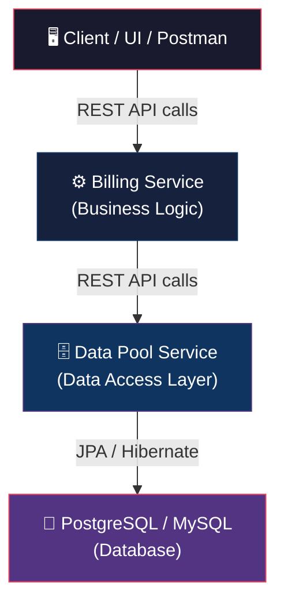
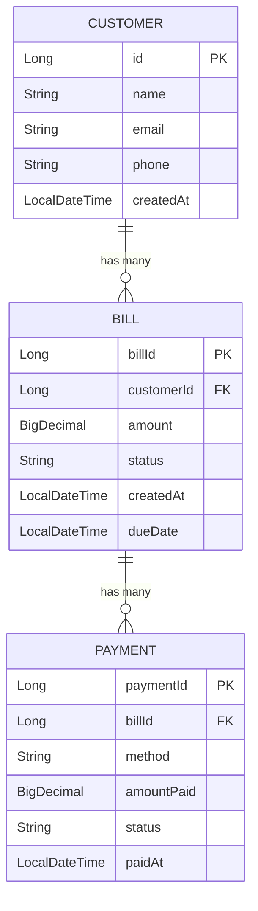
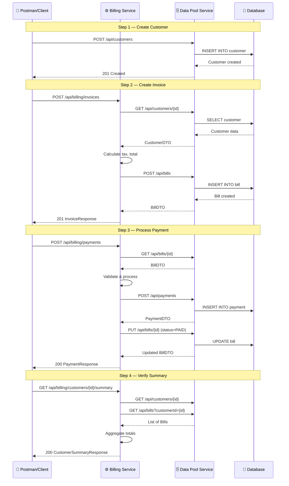

# Online Billing Service — Project Breakdown & Action Plan

## 🎯 What Is This Project?

This project is a **microservices-based Online Billing System** — a backend application that handles creating invoices, processing payments, and managing customer billing data.

Instead of building one monolithic application, you're splitting it into **two independent Spring Boot services** that talk to each other over REST APIs:



### Why Two Services?

| Concept | Explanation |
|---------|-------------|
| **Single Responsibility** | Each service does ONE thing well. Billing Service handles business rules; Data Pool Service handles database operations. |
| **Isolated Data Access** | No service touches the database directly except Data Pool. This prevents tight coupling and makes the system easier to maintain. |
| **Real-World Pattern** | This mirrors how companies like Netflix, Amazon, and Uber structure their backends. You're learning industry-standard architecture. |

### The Analogy

Think of it like a restaurant:
- **Billing Service** = The **Chef** — knows the recipes (business logic), decides what to cook and how
- **Data Pool Service** = The **Pantry/Warehouse** — stores and retrieves ingredients (data) when the chef asks
- **Database** = The actual **shelves and storage** where ingredients sit

The chef never walks into the warehouse directly — they send a request, and the pantry staff fetches what's needed.

---

## 🏗️ Architecture Deep Dive

### Service 1: Data Pool Service (Member 2 Owns)
> The "data gateway" — the ONLY service that talks to the database

**Responsibilities:**
- Defines the database schema (tables, relationships)
- Exposes CRUD REST endpoints for each entity (Customer, Bill, Payment)
- Handles data validation at the persistence layer
- Runs database migrations

**Database Schema:**



**Key statuses:**
- Bill: `DRAFT` → `ISSUED` → `PAID` / `OVERDUE` / `CANCELLED`
- Payment: `PENDING` → `SUCCESS` / `FAILED`

---

### Service 2: Billing Service (YOU — Member 3)
> The "brain" — contains all business logic and orchestration

**Responsibilities:**
- Invoice creation workflow (validate customer → calculate amounts → create bill)
- Payment processing workflow (validate bill → process payment → update bill status)
- Billing calculations (taxes, discounts, totals)
- Calls Data Pool Service via REST to fetch/save data
- Never touches the database directly

---

### Member 1 (Lead/Integrator)
> The "glue" — owns architecture, Docker, integration testing, demo

**Responsibilities:**
- Defines the API contracts between services (OpenAPI/Swagger specs)
- Creates the `docker-compose.yml` to run everything together
- Writes integration tests that span both services
- Prepares the final demo

---

## 📋 The API Contract (Critical — All 3 Members Must Agree)

> [!IMPORTANT]
> Before anyone writes code, Member 1 should finalize these API contracts. Both Member 2 and Member 3 code against this contract. This is the "handshake" between services.

### Data Pool Service Endpoints (Member 2 implements, Member 3 consumes)

| Method | Endpoint | Purpose |
|--------|----------|---------|
| `POST` | `/api/customers` | Create a new customer |
| `GET` | `/api/customers/{id}` | Get customer by ID |
| `GET` | `/api/customers` | List all customers |
| `PUT` | `/api/customers/{id}` | Update customer |
| `POST` | `/api/bills` | Create a new bill |
| `GET` | `/api/bills/{id}` | Get bill by ID |
| `GET` | `/api/bills?customerId={id}` | Get bills for a customer |
| `PUT` | `/api/bills/{id}` | Update bill (e.g., status) |
| `POST` | `/api/payments` | Record a payment |
| `GET` | `/api/payments/{id}` | Get payment by ID |
| `GET` | `/api/payments?billId={id}` | Get payments for a bill |

### Billing Service Endpoints (YOU implement — exposed to the client/UI)

| Method | Endpoint | Purpose |
|--------|----------|---------|
| `POST` | `/api/billing/invoices` | Create an invoice for a customer |
| `GET` | `/api/billing/invoices/{id}` | Get invoice details with calculations |
| `POST` | `/api/billing/payments` | Process a payment against a bill |
| `GET` | `/api/billing/customers/{id}/summary` | Get full billing summary for a customer |
| `GET` | `/api/billing/invoices/{id}/status` | Check invoice/payment status |

---

## 🚀 YOUR Action Plan — Member 3 (Billing Owner)

> [!NOTE]
> Estimated timeline: **3–4 weeks** for a solid, demo-ready project. Adjust based on your internship duration.

---

### Phase 1: Foundation & Setup (Days 1–3)

#### Task 1.1 — Learn the Prerequisites
- [ ] Understand REST API basics (HTTP methods, status codes, request/response bodies)
- [ ] Understand Spring Boot fundamentals (controllers, services, dependency injection)
- [ ] Understand what a REST client is (you'll use `RestTemplate` or `WebClient` to call Data Pool Service)
- [ ] Read about DTOs (Data Transfer Objects) — you'll send/receive these, not database entities

> **Skill Gained:** Spring Boot fundamentals, REST architecture

#### Task 1.2 — Set Up Your Spring Boot Project
- [ ] Go to [start.spring.io](https://start.spring.io) and create a new project:
  - **Group:** `com.billing`
  - **Artifact:** `billing-service`
  - **Dependencies:** Spring Web, Spring Boot DevTools, Lombok, Spring Boot Actuator
  - **Java:** 17
  - **Build:** Maven
- [ ] Import into IntelliJ IDEA / VS Code
- [ ] Verify it runs on port `8081` (Data Pool runs on `8080`)
- [ ] Add to Git, push to shared repository

```yaml
# application.yml
server:
  port: 8081

datapool:
  base-url: http://localhost:8080/api
```

> **Skill Gained:** Project scaffolding, Spring Boot configuration, Git basics

#### Task 1.3 — Define Your Package Structure

```
com.billing
├── config/            # RestTemplate bean, CORS config
├── controller/        # REST controllers (your API endpoints)
├── service/           # Business logic layer
├── client/            # Data Pool Service client (REST calls)
├── dto/               # Request/Response DTOs
│   ├── request/
│   └── response/
├── exception/         # Custom exceptions + global handler
└── BillingServiceApplication.java
```

> **Skill Gained:** Clean architecture, package-by-layer pattern

---

### Phase 2: Build the Data Pool Client (Days 4–6)

> This is YOUR bridge to Member 2's service. You call their APIs from here.

#### Task 2.1 — Configure RestTemplate

```java
@Configuration
public class RestTemplateConfig {

    @Bean
    public RestTemplate restTemplate(RestTemplateBuilder builder) {
        return builder
            .setConnectTimeout(Duration.ofSeconds(5))
            .setReadTimeout(Duration.ofSeconds(5))
            .build();
    }
}
```

#### Task 2.2 — Create DTOs (matching Data Pool's API responses)

```java
// Example: CustomerDTO
@Data
@NoArgsConstructor
@AllArgsConstructor
public class CustomerDTO {
    private Long id;
    private String name;
    private String email;
    private String phone;
}
```

Create DTOs for: `CustomerDTO`, `BillDTO`, `PaymentDTO`, `CreateBillRequest`, `CreatePaymentRequest`

#### Task 2.3 — Build the DataPoolClient class

```java
@Component
public class DataPoolClient {

    private final RestTemplate restTemplate;

    @Value("${datapool.base-url}")
    private String baseUrl;

    public CustomerDTO getCustomer(Long id) {
        return restTemplate.getForObject(
            baseUrl + "/customers/" + id, CustomerDTO.class);
    }

    public BillDTO createBill(CreateBillRequest request) {
        return restTemplate.postForObject(
            baseUrl + "/bills", request, BillDTO.class);
    }

    // ... more methods for all Data Pool endpoints you need
}
```

> [!TIP]
> **Pro Move:** Even before Member 2 finishes their service, you can write and test this client by **mocking** the Data Pool responses using Mockito. This way you don't block on anyone.

> **Skills Gained:** REST client development, inter-service communication, `RestTemplate` / `WebClient`, DTO pattern

---

### Phase 3: Business Logic — The Core (Days 7–12)

> This is the HEART of your work. This is where you prove you understand business logic.

#### Task 3.1 — Invoice Creation Service

```java
@Service
public class BillingService {

    private final DataPoolClient dataPoolClient;

    public InvoiceResponse createInvoice(CreateInvoiceRequest request) {
        // 1. Validate customer exists
        CustomerDTO customer = dataPoolClient.getCustomer(request.getCustomerId());
        if (customer == null) throw new CustomerNotFoundException(...);

        // 2. Calculate billing amounts
        BigDecimal subtotal = request.getAmount();
        BigDecimal tax = subtotal.multiply(new BigDecimal("0.18")); // 18% GST
        BigDecimal total = subtotal.add(tax);

        // 3. Create bill via Data Pool
        CreateBillRequest billRequest = new CreateBillRequest();
        billRequest.setCustomerId(customer.getId());
        billRequest.setAmount(total);
        billRequest.setStatus("ISSUED");

        BillDTO bill = dataPoolClient.createBill(billRequest);

        // 4. Build response
        return InvoiceResponse.builder()
            .billId(bill.getBillId())
            .customerName(customer.getName())
            .subtotal(subtotal)
            .tax(tax)
            .total(total)
            .status("ISSUED")
            .build();
    }
}
```

#### Task 3.2 — Payment Processing Service

```java
public PaymentResponse processPayment(ProcessPaymentRequest request) {
    // 1. Fetch the bill
    BillDTO bill = dataPoolClient.getBill(request.getBillId());
    if (bill == null) throw new BillNotFoundException(...);

    // 2. Validate bill is payable
    if ("PAID".equals(bill.getStatus()))
        throw new BillAlreadyPaidException(...);
    if ("CANCELLED".equals(bill.getStatus()))
        throw new BillCancelledException(...);

    // 3. Validate payment amount
    BigDecimal alreadyPaid = getAlreadyPaidAmount(bill.getBillId());
    BigDecimal remaining = bill.getAmount().subtract(alreadyPaid);
    if (request.getAmount().compareTo(remaining) > 0)
        throw new OverpaymentException(...);

    // 4. Record payment via Data Pool
    CreatePaymentRequest paymentReq = new CreatePaymentRequest();
    paymentReq.setBillId(bill.getBillId());
    paymentReq.setAmountPaid(request.getAmount());
    paymentReq.setMethod(request.getMethod());
    paymentReq.setStatus("SUCCESS");

    PaymentDTO payment = dataPoolClient.createPayment(paymentReq);

    // 5. Update bill status if fully paid
    if (request.getAmount().compareTo(remaining) == 0) {
        dataPoolClient.updateBillStatus(bill.getBillId(), "PAID");
    }

    return PaymentResponse.builder()
        .paymentId(payment.getPaymentId())
        .billId(bill.getBillId())
        .amountPaid(request.getAmount())
        .remainingBalance(remaining.subtract(request.getAmount()))
        .status("SUCCESS")
        .build();
}
```

#### Task 3.3 — Customer Billing Summary

```java
public CustomerSummaryResponse getCustomerSummary(Long customerId) {
    CustomerDTO customer = dataPoolClient.getCustomer(customerId);
    List<BillDTO> bills = dataPoolClient.getBillsByCustomer(customerId);

    BigDecimal totalBilled = bills.stream()
        .map(BillDTO::getAmount)
        .reduce(BigDecimal.ZERO, BigDecimal::add);

    long paidCount = bills.stream()
        .filter(b -> "PAID".equals(b.getStatus())).count();

    long pendingCount = bills.stream()
        .filter(b -> "ISSUED".equals(b.getStatus())).count();

    return CustomerSummaryResponse.builder()
        .customerId(customer.getId())
        .customerName(customer.getName())
        .totalBilled(totalBilled)
        .totalBills(bills.size())
        .paidBills((int) paidCount)
        .pendingBills((int) pendingCount)
        .build();
}
```

> **Skills Gained:** Business logic design, financial calculations with `BigDecimal`, state machine patterns, validation logic

---

### Phase 4: Controllers & Error Handling (Days 13–15)

#### Task 4.1 — Create REST Controllers

```java
@RestController
@RequestMapping("/api/billing")
public class BillingController {

    private final BillingService billingService;

    @PostMapping("/invoices")
    public ResponseEntity<InvoiceResponse> createInvoice(
            @Valid @RequestBody CreateInvoiceRequest request) {
        return ResponseEntity.status(HttpStatus.CREATED)
            .body(billingService.createInvoice(request));
    }

    @PostMapping("/payments")
    public ResponseEntity<PaymentResponse> processPayment(
            @Valid @RequestBody ProcessPaymentRequest request) {
        return ResponseEntity.ok(billingService.processPayment(request));
    }

    @GetMapping("/customers/{id}/summary")
    public ResponseEntity<CustomerSummaryResponse> getCustomerSummary(
            @PathVariable Long id) {
        return ResponseEntity.ok(billingService.getCustomerSummary(id));
    }
}
```

#### Task 4.2 — Global Exception Handler

```java
@RestControllerAdvice
public class GlobalExceptionHandler {

    @ExceptionHandler(CustomerNotFoundException.class)
    public ResponseEntity<ErrorResponse> handleCustomerNotFound(CustomerNotFoundException ex) {
        return ResponseEntity.status(HttpStatus.NOT_FOUND)
            .body(new ErrorResponse("CUSTOMER_NOT_FOUND", ex.getMessage()));
    }

    @ExceptionHandler(BillAlreadyPaidException.class)
    public ResponseEntity<ErrorResponse> handleAlreadyPaid(BillAlreadyPaidException ex) {
        return ResponseEntity.status(HttpStatus.CONFLICT)
            .body(new ErrorResponse("BILL_ALREADY_PAID", ex.getMessage()));
    }

    // ... more handlers
}
```

> **Skills Gained:** RESTful API design, input validation (`@Valid`), proper HTTP status codes, centralized error handling

---

### Phase 5: Unit Testing (Days 16–19)

> [!IMPORTANT]
> This is where you stand out. Good tests show maturity as a developer.

#### Task 5.1 — Unit Test BillingService with Mockito

```java
@ExtendWith(MockitoExtension.class)
class BillingServiceTest {

    @Mock private DataPoolClient dataPoolClient;
    @InjectMocks private BillingService billingService;

    @Test
    void createInvoice_shouldCalculateTaxAndCreateBill() {
        // Given
        when(dataPoolClient.getCustomer(1L))
            .thenReturn(new CustomerDTO(1L, "John", "john@test.com", "1234567890"));
        when(dataPoolClient.createBill(any()))
            .thenReturn(new BillDTO(100L, 1L, new BigDecimal("118.00"), "ISSUED", null, null));

        // When
        CreateInvoiceRequest request = new CreateInvoiceRequest(1L, new BigDecimal("100.00"));
        InvoiceResponse response = billingService.createInvoice(request);

        // Then
        assertEquals(new BigDecimal("18.00"), response.getTax());     // 18% of 100
        assertEquals(new BigDecimal("118.00"), response.getTotal());   // 100 + 18
        assertEquals("ISSUED", response.getStatus());
        verify(dataPoolClient).createBill(any());
    }

    @Test
    void processPayment_shouldRejectAlreadyPaidBill() {
        when(dataPoolClient.getBill(1L))
            .thenReturn(new BillDTO(1L, 1L, new BigDecimal("100"), "PAID", null, null));

        assertThrows(BillAlreadyPaidException.class,
            () -> billingService.processPayment(new ProcessPaymentRequest(1L, new BigDecimal("100"), "UPI")));
    }
}
```

#### Task 5.2 — Unit Test Controllers with MockMvc

```java
@WebMvcTest(BillingController.class)
class BillingControllerTest {

    @Autowired private MockMvc mockMvc;
    @MockBean private BillingService billingService;

    @Test
    void createInvoice_shouldReturn201() throws Exception {
        when(billingService.createInvoice(any())).thenReturn(/* mock response */);

        mockMvc.perform(post("/api/billing/invoices")
                .contentType(MediaType.APPLICATION_JSON)
                .content("{\"customerId\": 1, \"amount\": 100}"))
            .andExpect(status().isCreated())
            .andExpect(jsonPath("$.total").value(118.00));
    }
}
```

> **Skills Gained:** Unit testing, Mockito, MockMvc, TDD mindset, test isolation

---

### Phase 6: Integration & Polish (Days 20–23)

#### Task 6.1 — Integration Testing with Member 2
- [ ] Start both services locally (Data Pool on 8080, Billing on 8081)
- [ ] Test the full flow via Postman:
  1. Create a customer (via Data Pool)
  2. Create an invoice (via Billing Service → calls Data Pool)
  3. Process a payment (via Billing Service → calls Data Pool)
  4. Verify bill status is updated to `PAID`

#### Task 6.2 — Add Swagger/OpenAPI Documentation
- [ ] Add `springdoc-openapi-starter-webmvc-ui` dependency
- [ ] Annotate controllers with `@Operation`, `@ApiResponse`
- [ ] Verify Swagger UI at `http://localhost:8081/swagger-ui.html`

#### Task 6.3 — Add Logging
```java
@Slf4j  // Lombok
@Service
public class BillingService {
    public InvoiceResponse createInvoice(CreateInvoiceRequest request) {
        log.info("Creating invoice for customerId={}", request.getCustomerId());
        // ... business logic
        log.info("Invoice created: billId={}, total={}", bill.getBillId(), total);
    }
}
```

#### Task 6.4 — Dockerize Your Service (coordinate with Member 1)
```dockerfile
FROM eclipse-temurin:17-jre-alpine
WORKDIR /app
COPY target/billing-service-0.0.1-SNAPSHOT.jar app.jar
ENTRYPOINT ["java", "-jar", "app.jar"]
```

> **Skills Gained:** Integration testing, API documentation, Docker, logging best practices

---

### Phase 7: Demo Preparation (Days 24–25)

#### Task 7.1 — Prepare Demo Script
- [ ] Write a step-by-step demo flow showing the full lifecycle
- [ ] Prepare Postman collection with all API calls pre-configured
- [ ] Test the entire flow end-to-end 3 times

#### Task 7.2 — Demo Flow



---

## 🧠 Skills You Will Learn (Industry-Relevant)

| Skill | Where You Learn It | Industry Relevance |
|-------|--------------------|--------------------|
| **Spring Boot** | Entire project | #1 Java framework used in enterprise |
| **REST API Design** | Controllers, DTOs | Every backend job requires this |
| **Inter-service Communication** | DataPoolClient | Core microservices skill |
| **Business Logic Design** | BillingService | Shows you can think, not just code |
| **Unit Testing (Mockito)** | Phase 5 | Required at every company |
| **Error Handling** | GlobalExceptionHandler | Production-grade code quality |
| **Docker** | Phase 6 | DevOps/deployment essential |
| **API Documentation (Swagger)** | Phase 6 | Professional-grade delivery |
| **Git Collaboration** | Throughout | Version control fluency |
| **BigDecimal for Money** | Calculations | Financial software standard |

---

## ⚡ Tips for Success

> [!TIP]
> **Don't wait for Member 2.** Use Mockito to mock `DataPoolClient` responses and build your entire service independently. When Member 2 is ready, swap mocks for real calls — it should "just work" if the API contract was followed.

> [!TIP]
> **Test edge cases.** What if the customer doesn't exist? What if someone tries to pay a cancelled bill? What if the amount is negative? Handling these makes your code production-quality.

> [!TIP]
> **Use Postman Collections.** Save all your API calls in a Postman collection and export it. This becomes your demo script AND documentation.

> [!WARNING]
> **Never use `double` or `float` for money.** Always use `BigDecimal`. Floating-point arithmetic will cause rounding errors in financial calculations (e.g., `0.1 + 0.2 ≠ 0.3`).

---

## 📅 Timeline Summary

| Week | Phase | Deliverables |
|------|-------|-------------|
| **Week 1** | Setup + Data Pool Client | Running Spring Boot app, `DataPoolClient` class, DTOs |
| **Week 2** | Business Logic + Controllers | `BillingService` with invoice/payment flows, REST controllers, error handling |
| **Week 3** | Testing + Integration | Unit tests (80%+ coverage), integration with Data Pool, Swagger docs |
| **Week 4** | Polish + Demo | Docker, logging, Postman collection, demo rehearsal |
